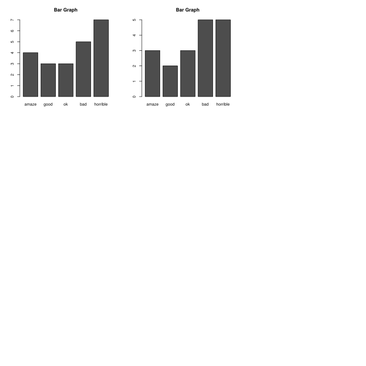

<link rel="stylesheet" href="css/bulma.css" type="text/css" media="print" />
<style>
.title{margin:0px;}
hr{margin:0; margin-top:3px;}
.headerTitle{font-size:12px;}
p{margin-bottom: 16px;}
strong{color:rgba(54, 54, 54, 0.82);}
.caption{ font-size:12px; font-weight:bold; margin-top:10px; margin-bottom: 10px;}
caption{font-size:12px; font-weight:bold; margin-top: 10px;}
h1{font-weight:bold; margin-top:5px; margin-bottom:3px; margin-top:13px; }
h2{font-size: 38px;margin-top:15px; margin-bottom:3px; margin-top:13px; }
h3{font-size: 30px;margin-top:12px; margin-bottom:3px; margin-top:13px; }
h4{font-size: 20px;margin-top:13px; margin-bottom:3px; margin-top:13px; }
h5{font-size: 16px;margin-top:12px; margin-bottom:3px; margin-top:13px; }
img{display: block;margin-left: auto;margin-right: auto}
.container{padding: 12px;}
.table{font-size: 11px;}
.body{width:980px; max-width:980px; margin:auto 10;}
.figure{text-align:center}
img{width:94%; align="middle";margin: 0 auto;}
.detailDesc{ border-radius:5px; font-size:11px; border:1.5px solid gray; padding:9px;}
.iv_table{ font-size:10px;}
.iv_table table{max-width:600px;}
.result-table td{font-size:}
</style>

<div class="container">

```{r setup, include=FALSE, echo=F}
knitr::opts_chunk$set(echo = TRUE)
knitr::knit_hooks$set(source = function(x, options) {
  return(paste0(
    "```{.r",
    ifelse(is.null(options$class),
      "",
      paste0(" .", gsub(" ", " .", options$class))
    ),
    "}\n",
    x,
    "\n```"
  ))
})
```

```{r include=FALSE}
library(knitr)
```
<div class="headerTitle">OURHOME</div>
<div class="headerTitle">by YBROAD</div>

***

## 주간 데이터

### 테이블 데이터
```{r echo=F}
kable(readRDS(file="tables/weekly.Rda"), table.attr = "class=\"table is-striped\"", format="html", caption="Table 1. 주간 통계")
```

### 히스토그램


